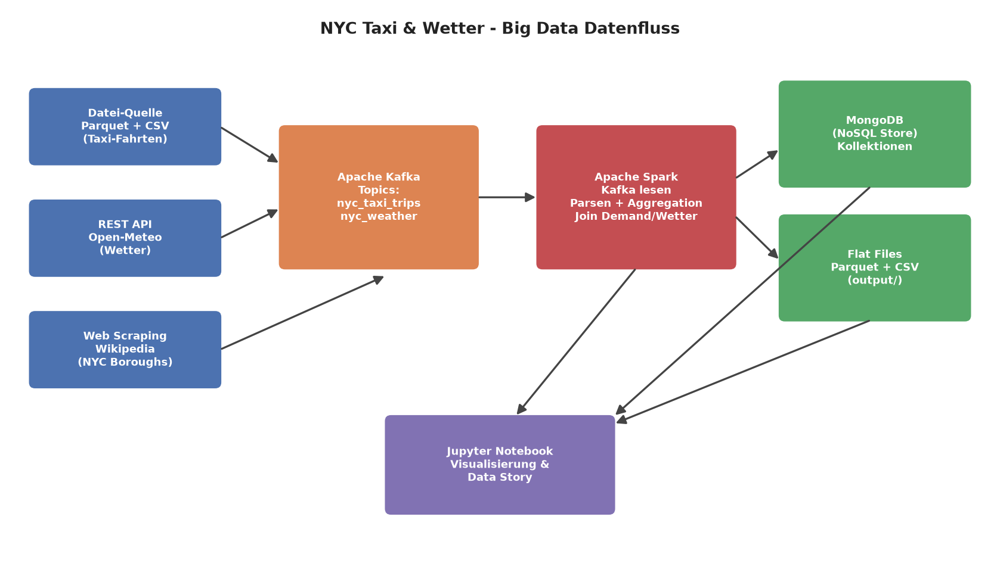

# NYC Taxi & Weather – Big Data Engineering Pipeline

Analyse des Einflusses von Wetterereignissen auf die Taxinachfrage in New York City (Januar 2023).
Der Fokus liegt auf dem **Data-Engineering-Setup**: drei heterogene Datenquellen werden über
**Apache Kafka** bereitgestellt, mit **Apache Spark** verarbeitet und in **MongoDB** sowie als
**Flat Files** persistiert.

**Team:** Aron Milojevic, Mateusz Pacyga, Ajay Pal

## Architektur



| Schicht | Technologie |
|---------|-------------|
| Datenquellen | Datei (Parquet/CSV), REST-API (Open-Meteo), Web Scraping (Wikipedia) |
| Broker | Apache Kafka (Topics `nyc_taxi_trips`, `nyc_weather`) |
| Verarbeitung | Apache Spark (Structured Batch Read aus Kafka, Aggregation, Join) |
| Speicherung | MongoDB (NoSQL) + Parquet/CSV Flat Files (`output/`) |
| Visualisierung | Jupyter Notebook |

## Erfüllte MUST-HAVE-Kriterien

- **3 Datenquellen:** Datei (`Rohdaten/`), REST-API (Open-Meteo), Web Scraping (Wikipedia Boroughs)
- **Kafka:** Producer in `producers/` schreiben JSON-Events in zwei Topics
- **Spark:** `spark_app/spark_processing.py` liest aus Kafka, transformiert und aggregiert
- **Storage:** Ergebnisse in MongoDB und Flat Files (ETL)
- **Story & Visualisierung:** 7 Diagramme im Notebook
- **Datenfluss-Diagramm:** `architektur.png`
- **Dokumentation:** `Big_Data_Infrastruktur_Projekt_NYC.ipynb`

## Projektstruktur

```
NYC_Taxi_Project/
├─ Big_Data_Infrastruktur_Projekt_NYC.ipynb   Haupt-Dokumentation
├─ docker-compose.yml                         Kafka, Kafka-UI, MongoDB
├─ requirements.txt                           Python-Abhängigkeiten
├─ architektur.png                            Datenfluss-Diagramm
├─ make_architecture.py                       Erzeugt das Diagramm
├─ pipeline/                                  Wiederverwendbare Module
│  ├─ config.py
│  ├─ sources.py        (Datei, REST-API, Web Scraping)
│  ├─ kafka_pipeline.py (Topics + Producer)
│  ├─ spark_pipeline.py (Spark-Read + Transformationen)
│  └─ storage.py        (MongoDB + Flat Files)
├─ producers/
│  ├─ taxi_trip_producer.py
│  └─ weather_producer.py
├─ spark_app/
│  └─ spark_processing.py
├─ hadoop/bin/          winutils.exe + hadoop.dll (Spark unter Windows)
├─ Rohdaten/            Taxi-Parquet + Wetter-CSV
└─ output/              Erzeugte Flat Files (Parquet/CSV)
```

## Voraussetzungen

- Python 3.11+ mit den Paketen aus `requirements.txt` (`pip install -r requirements.txt`)
- Java 17 (für Spark)
- Docker (für Kafka, Kafka-UI, MongoDB)

## Ausführung

1. **Infrastruktur starten**
   ```bash
   docker compose up -d
   ```
   Kafka ist anschließend unter `localhost:29092`, Kafka-UI unter `localhost:8080`
   und MongoDB unter `localhost:27017` erreichbar.

2. **Pipeline ausführen** – entweder vollständig über das Notebook
   (`Big_Data_Infrastruktur_Projekt_NYC.ipynb`) oder schrittweise über die Skripte:
   ```bash
   python producers/weather_producer.py
   python producers/taxi_trip_producer.py
   python spark_app/spark_processing.py
   ```

## Hinweis (Windows)

Spark benötigt unter Windows `winutils.exe` und `hadoop.dll` (in `hadoop/bin/` enthalten) sowie ein
gültiges `JAVA_HOME`. Beides wird in `pipeline/config.configure_spark_environment()` automatisch
gesetzt.
